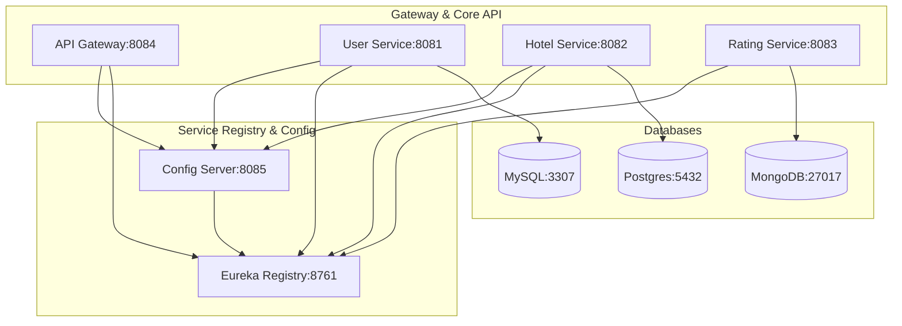

# Distributed Hotel Rating & Booking Platform

[](https://spring.io/projects/spring-boot)
[](https://spring.io/projects/spring-cloud)
[](https://resilience4j.readme.io/)
[](https://www.docker.com/)

A modern, highly resilient, and fault-tolerant microservices-based application built with **Spring Boot** and **Spring Cloud**. This system demonstrates dynamic service discovery, centralized configuration, API routing, and robust fault-tolerance mechanisms.

---

## 🏛️ System Architecture

The application is structured into specialized services that communicate over a distributed network:



---

## ⚙️ Tech Stack & Microservices Overview

### Infrastructure Services
*   **API Gateway (8084)**: Acts as the single entry point. Integrates **Okta OAuth2** for request validation and security token checks. Dynamically routes requests using service names (`lb://`).
*   **Service Registry (8761)**: Powered by **Netflix Eureka Server** for dynamic service registration and lookup.
*   **Config Server (8085)**: Centralized configuration manager fetching service settings from a remote Git repository.

### Core Business Services
*   **User Service (8081)**: Manages users and orchestrates rating details. Connects to **MySQL**. Uses **Resilience4j** annotations for Circuit Breaker, Retry, and Rate Limiter.
*   **Hotel Service (8082)**: Manages hotels. Connects to **PostgreSQL**.
*   **Rating Service (8083)**: Manages rating reviews. Connects to **MongoDB**.

---

## ⚡ Resilience & Fault Tolerance (Resilience4j)

The `UserService` controller handles transient network issues and cascading microservices failures gracefully:
*   **Circuit Breaker (`ratingHotelBreaker`)**: Prevents continuous requests to down services. Falls back to a default mock user response.
*   **Rate Limiter (`userRateLimiter`)**: Limits user requests (e.g., 2 calls per 4 seconds) to prevent brute force/server overloading.
*   **Retry (`ratingHotelService`)**: Automatically retries failed service calls 3 times before triggering fallback mechanisms.

---

## 🚀 One-Click Launch in GitHub Codespaces (Free Cloud Hosting)

This repository is equipped with a Dev Container setup allowing you to run the complete ecosystem in a free 8GB cloud machine:

1. Click on the green **Code** button at the top of the repository.
2. Select **Codespaces** and click **Create codespace on main**.
3. Once the environment loads, it will automatically:
   - Run Docker and Docker Compose.
   - Boot up the databases and all microservices.
   - Expose public URLs for the API Gateway and Eureka Registry in the **Ports** panel.

---

## 🐳 Running Locally (Docker Compose)

### Prerequisites
*   Docker Desktop installed.

### Commands
In the root directory of the project, run:
```bash
docker-compose up -d --build
```
This builds all microservices images and boots up the entire suite. You can monitor the startup using:
```bash
docker-compose logs -f
```

### Exposed Endpoints
*   **Eureka Dashboard**: `http://localhost:8761`
*   **Config Server**: `http://localhost:8085`
*   **API Gateway Route (Users)**: `http://localhost:8084/users`
